### Abhinesh Dahal

Senior at Texas State University, double-majoring in Computer Science
and Applied Mathematics. I work at the data layer: consensus, storage
engines, replication, and the infrastructure underneath backends.
I build things from the ground up because it forces me to understand
what happens beneath the abstractions, and I document what I learn as
carefully as I build.

| | |
|---|---|
| [raft-kv](https://github.com/DahalAb1/raft-kv) | Raft and a linearizable key/value store in Go: leader election, log replication, persistence, snapshots, and the fast-backup conflict optimization. Validated with 100-run test gauntlets; the README is the full build story, bug by bug. |
| [raft-demo](https://github.com/DahalAb1/raft-demo) | The same code running live: election, failover, crash recovery. `go run .`, or [watch it animated](https://dahalab1.github.io/raft-demo/). |
| [Redis](https://github.com/DahalAb1/Redis) | A Redis-style server in C++ built up from raw TCP sockets: byte-stream framing, a poll-based event loop, non-blocking I/O, and a custom hashtable with progressive resizing. Written up chapter by chapter. |

Before systems, a data-science internship at the Texas Department of
Family and Protective Services: survival analysis on statewide
foster-care placement data across 254 counties, presented to 40+
stakeholders.

**Looking for:** software engineering internships for Summer 2027,
ideally infrastructure or distributed systems.

[LinkedIn](https://linkedin.com/in/abhinesh-dahal) · dahalabhinesh1@gmail.com · favorite book: *The Count of Monte Cristo*
