<picture>
  <source media="(prefers-color-scheme: dark)" srcset="assets/banner-dark.svg">
  
</picture>

I build systems from first principles: complex infrastructure is a
composition of simple concepts, and I take things apart until that
composition is visible.

**Building now:** consensus from the ground up.

| | |
|---|---|
| [raft-kv](https://github.com/DahalAb1/raft-kv) | Raft and a linearizable key/value store in Go. ~1,700 lines, validated with 100-run test gauntlets. The README is the full build story, bug by bug. |
| [raft-demo](https://github.com/DahalAb1/raft-demo) | The same code running live: election, failover, crash recovery. `go run .`, or [watch it animated](https://dahalab1.github.io/raft-demo/). |
| [Redis](https://github.com/DahalAb1/Redis) | A Redis-shaped server in C++, from scratch: event loop, protocol, hashtable. Written up chapter by chapter. |

[LinkedIn](https://linkedin.com/in/abhinesh-dahal) · dahalabhinesh1@gmail.com
