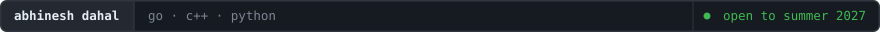

<!-- ──────────────────────── hero ──────────────────────── -->


<!-- ──────────────────────── about ─────────────────────── -->

I love building systems from the ground up.

I’m drawn to the layer underneath AI: the distributed systems, networking, storage, and compute infrastructure that determine whether a powerful model can actually serve millions of people reliably. I like problems where performance and reliability come from understanding what is happening all the way down the stack. That is the kind of engineering I want to get very good at.

<!-- ─────────────────────── projects ───────────────────── -->

### Projects

**[raft-kv](https://github.com/DahalAb1/raft-kv)** · Go — I implemented Raft from the [original paper](https://raft.github.io/raft.pdf), including leader election, log replication, crash persistence, and snapshots, then built a linearizable key/value store on top. The project is about 1,700 lines of Go. The hardest part was dealing with failures that depended on timing: the same test could pass several times and then fail because two nodes timed out in a different order, a message arrived later than expected, or a server crashed at the wrong moment. Debugging those failures forced me to stop thinking about the program as one predictable sequence of instructions and instead reason about many machines progressing independently while the network changes the order in which they observe events. That shift in thinking was the most valuable part of the project and gave me a much better understanding of why building reliable distributed systems is difficult.

[**Watch a cluster elect a leader →**](https://dahalab1.github.io/raft-demo/)

**[Redis](https://github.com/DahalAb1/Redis)** · C++ — I built a Redis-style server from scratch to understand what actually happens between a client sending a request and a server returning a value. Instead of using a networking framework, I worked directly with `socket()` and built the loop that accepts connections, reads requests, executes commands, and sends responses.

A major challenge was allowing one thread to handle many clients without getting stuck waiting for any one of them. I used non-blocking sockets with `poll()`, so the server can ask the operating system which connections are ready and only work on those connections. This turned concepts like event-driven servers and asynchronous I/O from abstractions into something I could reason about directly.

I also built the hash table used to store keys. Normally, when a hash table grows, moving millions of entries into a larger table can make one operation unexpectedly slow. Instead, mine moves a small amount of data at a time while normal requests continue. At four million keys, the worst insert during this resizing process stays under **1 ms**, compared with about **240 ms** for `std::unordered_map` in my benchmark. With pipelined requests over loopback, the server sustains about **1M GET operations per second on a single thread**.

The project gave me a much clearer picture of where server performance actually comes from: how connections are scheduled, how data is buffered, how memory is organized, and how a seemingly small data-structure decision can turn into a visible latency spike for a client.


<!-- ─────────────────────── before ─────────────────────── -->

**Before systems:** I interned as a Data Analyst at the Texas Department of Family and Protective Services, where I worked with four years of foster-care placement data from all 254 Texas counties. I built the data pipeline, developed a survival model to study placement stability, and presented the findings to more than forty stakeholders and the director. What I liked most about the work was that the analysis did not end with a model or a metric—the results changed what the team wanted to investigate next. It was my first experience seeing technical work become genuinely useful to the people making decisions from it.

<!-- ─────────────────────── expandables ────────────────── -->

<details>
<summary><code>cat how-i-got-here.md</code></summary>

<br>

I spent two years building from tutorials, which made me feel fast and left me
empty: I was decorating the top floors of a building whose foundation I had never
seen. A C++ course fixed that — pointers, memory, the machine underneath. I went
down the stack and stayed there, which is why every project here starts at the
bottom instead of at a library.

</details>

<details>
<summary><code>cat ~/.profile</code></summary>

<br>

Away from engineering, I play soccer and go mountain biking—mostly because I like things that are physical, fast, and force me to react instead of think everything through.

My GitHub avatar is Senku from *Dr. Stone*. What I like about him is not just that he is intelligent, but that he tries to understand things from first principles and then uses that understanding to build. That way of thinking is a large part of what drew me toward systems: I enjoy taking abstractions apart until I understand what is underneath them.

My favorite book is *The Count of Monte Cristo*. What stayed with me was not simply the main character's transformation, but how much of it comes from suffering, knowledge, patience, and the changing way he sees other people and himself. I like that the novel does not reduce him to a straightforward hero. He becomes more capable as the story progresses, but also more complicated, and that tension is what made the book feel human to me.

</details>

<!-- ─────────────────────── sign-off ───────────────────── -->

```
~ % grep lesson notes/raft.md
stay with a problem long enough and the shape of it appears
```

<!-- ────────────────────────  contact ─────────────────── -->

[LinkedIn](https://linkedin.com/in/abhinesh-dahal) ·
[dahalabhinesh1@gmail.com](mailto:dahalabhinesh1@gmail.com)

<!-- ─────────────────────── status bar ─────────────────── -->


