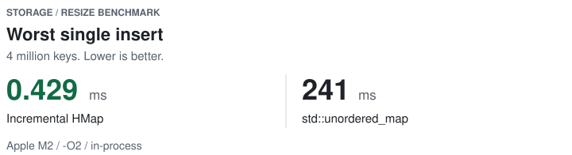

# Abhinesh Dahal

I study Computer Science and Applied Mathematics at Texas State University. I'm drawn to the work that makes software dependable: keeping servers in agreement, handling connections, and storing data without making people wait. I build systems from scratch to understand where that dependability comes from.

**Seeking a Summer 2027 software engineering internship.** 
[LinkedIn](https://linkedin.com/in/abhinesh-dahal) · [Email](mailto:dahalabhinesh1@gmail.com)

## Selected Work

### raft-kv · Go

**A key/value store replicated across servers.**

A server can fail while the others are still waiting to hear from it. I built a replicated key/value store to understand how those remaining machines agree on what happens next.

Starting with the [Raft paper](https://raft.github.io/raft.pdf), I implemented leader election, log replication, crash persistence, and snapshots, then built a linearizable key/value store on top.

<picture>
  <source media="(prefers-reduced-motion: reduce) and (prefers-color-scheme: dark) and (max-width: 600px)" srcset="assets/raft-election-static-compact-dark.svg">
  <source media="(prefers-reduced-motion: reduce) and (max-width: 600px)" srcset="assets/raft-election-static-compact-light.svg">
  <source media="(prefers-reduced-motion: reduce) and (prefers-color-scheme: dark)" srcset="assets/raft-election-static-dark.svg">
  <source media="(prefers-reduced-motion: reduce)" srcset="assets/raft-election-static-light.svg">
  <source media="(prefers-color-scheme: dark) and (max-width: 600px)" srcset="assets/raft-election-compact-dark.svg">
  <source media="(max-width: 600px)" srcset="assets/raft-election-compact-light.svg">
  <source media="(prefers-color-scheme: dark)" srcset="assets/raft-election-dark.svg">
  
</picture>

[**Watch a leader election**](https://dahalab1.github.io/raft-demo/) · [Explore the code](https://github.com/DahalAb1/raft-kv)

What timing-dependent failures taught me

The hardest bugs did not fail on command. A test could pass several times, then break because two servers timed out in a different order or a reply arrived after a new election.

Debugging them meant tracing what each machine knew at the moment it acted. Repeated test runs helped me find patterns that a single passing run concealed. I came away with a different way of reasoning about correctness: an operation has to remain safe even when the world changes before its reply comes back.

The implementation uses MIT 6.5840's lab structure; the course-provided harness and tests are excluded from the public repository. The companion demo runs the implementation with its own transport.

### Redis-style server · C++

**An in-memory database, from the socket to the stored value.**

A fast server can still make a client wait. Working through *Build Your Own Redis*, I implemented a server with non-blocking sockets, a `poll()` event loop, and an incrementally resized hash table. I then wrote benchmarks to investigate where delays remained.

One revealing measurement was the slowest insert as the table grew to four million keys:

<picture>
  <source media="(prefers-color-scheme: dark) and (max-width: 600px)" srcset="assets/resize-latency-compact-dark.svg">
  <source media="(max-width: 600px)" srcset="assets/resize-latency-compact-light.svg">
  <source media="(prefers-color-scheme: dark)" srcset="assets/resize-latency-dark.svg">
  
</picture>

These are in-process data-structure measurements, not network response times. Custom entries were prepared before timing; `std::unordered_map` was not pre-reserved.

[**Read the benchmarks**](https://github.com/DahalAb1/Redis/tree/main/bench#incremental-resize-vs-stdunordered_map-tail-latency) · [Explore the code](https://github.com/DahalAb1/Redis)

Why resizing a hash table can delay a request

When a hash table grows, moving all its entries at once can turn one ordinary insert into a long pause. In a single-threaded server, other clients wait behind that operation.

This implementation spreads the migration across subsequent operations, moving at most 128 nodes each time. That limits the migration work per operation, although allocating the new bucket array can still cause a smaller spike.

The comparison measures the worst insert, not average performance. The custom table's entries and hashes are prepared outside the timed region, while `std::unordered_map::emplace` includes allocation and a duplicate-key check. The benchmark repository documents those differences and how to reproduce the results.

The server architecture and data-structure design follow James Smith's [*Build Your Own Redis*](https://build-your-own.org/redis/). The benchmarks, measurements, and analysis are my own.

